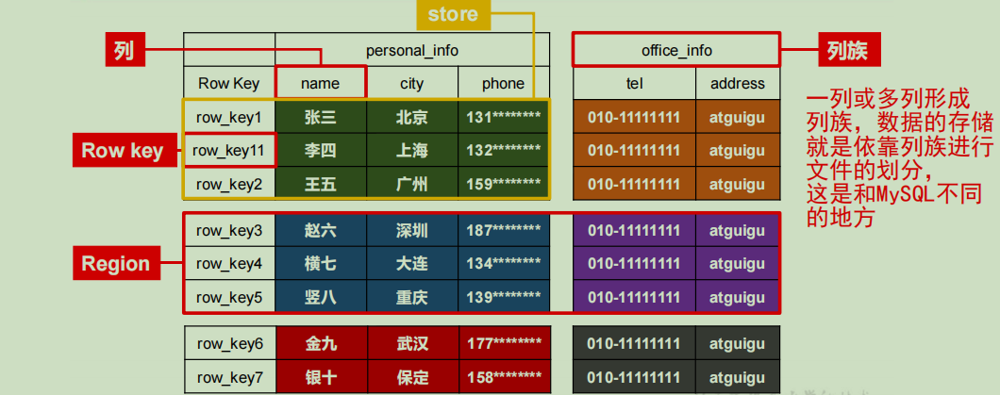

### HBase 入门
### 1，概念
- HBase 是一种**分布式、可扩展、支持海量数据存储**的**NoSQL**数据库；

#### 1.1 HBase 逻辑结构
- 以 JSON 为例：

```json
{
    "row_key1":{
        "personal_info": {
            "name": "zhangsan",
            "city":"广东",
            "phone": 198888
        },
        "office_info": {
            "tel": "010-2222",
            "address": "google"
        }
    },
    "row_key11":{
         "personal_info": {
            "city":"上海",
            "phone": 132999
        },
        "office_info": {
            "tel": "010-2222"
        }
    }
}
```

- HBase 逻辑架构



- HBase 物理存储结构


- HBase 基础架构

