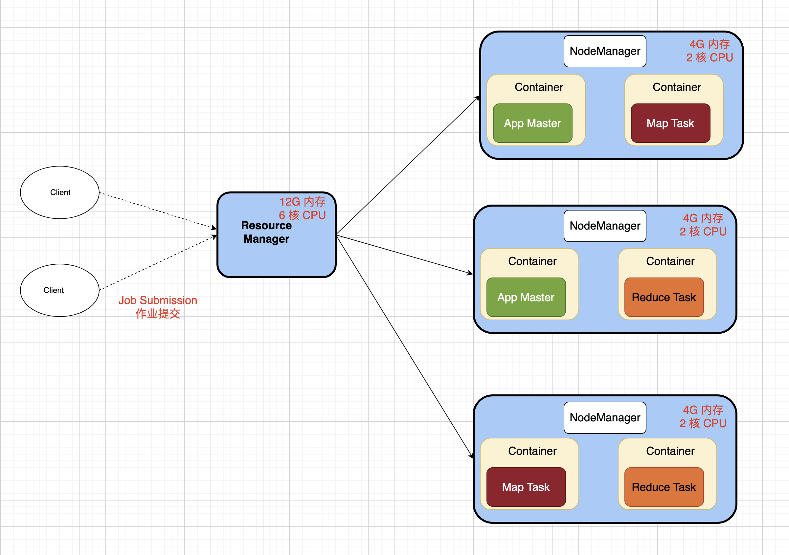
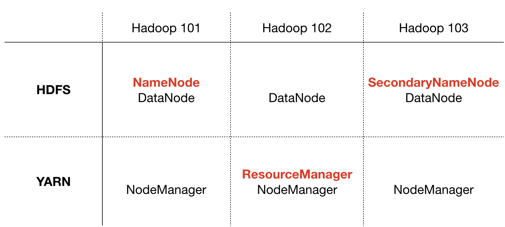
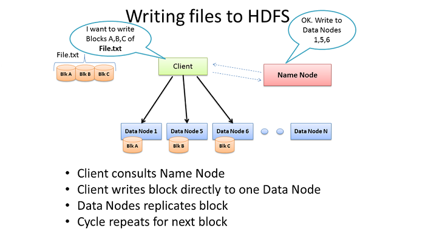
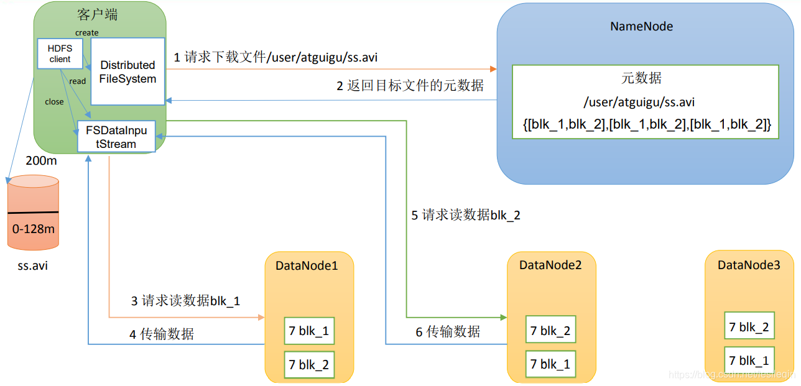
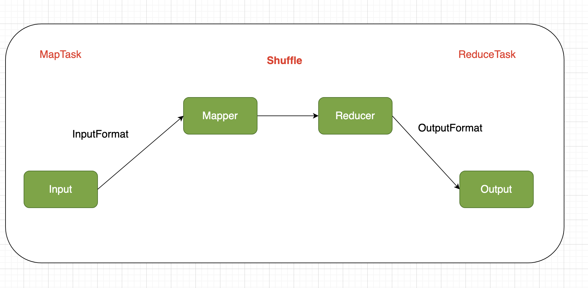
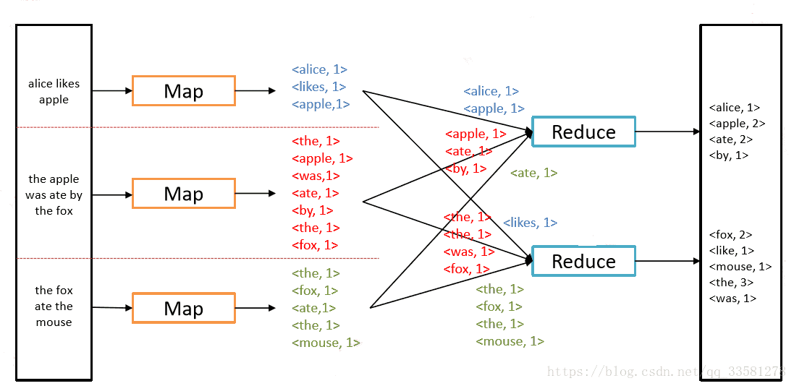
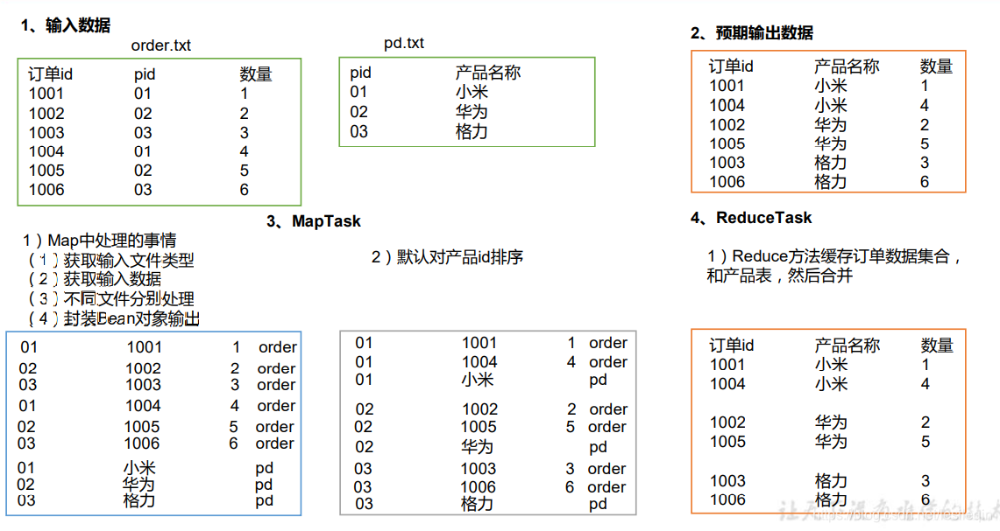

### Hadoop 入门

### 1，核心三大组件
- HDFS
- MapReduce
- Yarn

#### 1.1 HDFS（分布式文件系统）
- **NameNode(nn)**：存储文件的元数据，如文件名、文件目录结构、文件属性（生成时间、副本数、文件权限）以及每个文件的块列表和块所在的 DataNode；
- **DataNode(dn)**：在本地文件系统存储文件块数据以及块数据的校验和；
- **Secondary Name Node(2nn)**：每隔一段时间对 NameNode 元数据备份；

#### 1.2 MapReduce
- **Map 阶段**：并行处理输入数据；
- **Reduce 阶段**：对 Map 结果进行汇总；

#### 1.3 Yarn（Yet Another Resource Negotiator，Hadoop 的资源管理器）
- **Resource Manager**：整个集群资源（CPU、内存等）的管理者；
- **Node Manager**：单个节点服务器资源的管理者；
- **Application Master**：单个任务运行的管理者；
- **Container**：容器，相当于一台独立的服务器，里面封装了任务运行所需要的资源，如内存、CPU、磁盘、网络等；

#### 1.4 集群部署步骤及规划
- [集群部署步骤](./2023.10/Docker实战之部署Hadoop集群.md)

### 2，HDFS
- 常用命令
  - 创建文件夹：`hadoop fs -mkdir /data/input`
  - 上传文件：`hadoop fs -put [file] [targetDir]`

#### 2.1 HDFS 写数据流程

#### 2.2 HDFS 读数据流程

### 3，MapReduce
- `TextInputFormat`：按行读取每条记录；
- `CombineTextInputFormat`：用于处理小文件过多的场景，将多个小文件从逻辑上规划到一个切片中；

#### 3.1 WordCount 示例
- [wordCount 代码样例](https://github.com/xianliu18/bigdata_learning/tree/main/hadoop_learning/src/main/java/com/noodles/mapreduce/wordcount)
- [自定义序列化对象](https://github.com/xianliu18/bigdata_learning/tree/main/hadoop_learning/src/main/java/com/noodles/mapreduce/writable)
 

#### 3.2 Shuffle 介绍
- 将 MapTask 输出，分发给 ReduceTask，在分发的过程中，对数据按 Key 进行分区和排序，这个过程称为 Shuffle。
  - Map 端负责数据的溢写；
  - Reduce 端负责将 Map 的数据拷贝到本地，并进行归并排序；
- Map 端 Shuffle
  - Map 端把数据源源不断的写入到一个环形缓冲区(RingBuffer);
  - 当达到一定阈值时，新开启一个线程，将缓冲区的数据溢写到磁盘；
  - 在溢写过程中，调用 Partitioner 进行分组，对于每个组按照 Key 进行排序；
  - Map 处理完毕后，对磁盘的多个文件进行 Merge 操作，将大量文件合并为一个大文件（数据文件）和一个索引文件（每个 partition 在文件中的起始位置、长度等等）；

- Reduce 端 Shuffle
  - Map 端 shuffle 结束后，会暴露一个 HTTP 服务，供 Reduce 端获取数据；
  - Reduce 端启动拷贝线程，从各个 Map 端拷贝数据，一遍拷贝一遍进行归并排序操作，便于数据的下一步处理；

#### 3.3 Join 应用

### 4. Yarn
- 调度器：
  - FIFO
  - 容量调度器(Capacity Scheduler)
  - 公平调度器(Fair Scheduler)
- [详细解释](https://blog.csdn.net/FunnyPrince_/article/details/120244552)