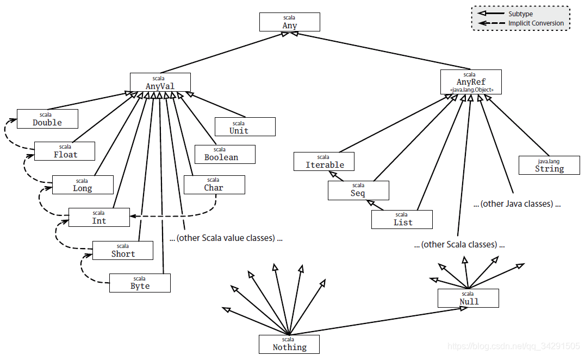

### Scala 入门
1，Scala 程序和 Java 程序的对比
	- Java 源代码通过 Javac 编译，编译结果为 Java 字节码、Java 类库；
	- Scala 源码通过 Scalac 编译，编译结果为 Java 字节码、Java 类库、Scala 类库；

#### 2.1 变量
  - val 定义的变量，不可重新赋值，即自定义常量；
  - var 定义的变量可以被重新赋值；

```scala
// 格式：
val/var 变量名:变量类型 = 初始值

var name:String = "李逵";
// 可以使用类型推断来定义变量
var name = "李鬼";

// 插值表达式
val/var 变量名 = s"${变量/表达式}字符串"

val res=s"name=${name}, age=${age}, sex=${sex}"

// 使用三引号，保存大块文本
val/var 变量名 = """ 字符串具体内容 """

// 惰性赋值
// 在大数据开发过程中，有可能编写非常复杂的 SQL 语句，当一些变量保存的数据较大时，而这些数据又不需要马上加载到 JVM 中，可以使用惰性赋值来提高效率；
lazy val/var = 变量名 = 值
```

#### 2.2 类型：
  - Any 是所有类型的父类，相当于 Java 中的 Object 类；
  - AnyVal 是所有数值类型的父类，AnyRef 是所有引用类型的父类；
  - Unit 类似于 Java 中的 void，一般作为返回值；
  - Null 是所有引用类型的子类，只有一个实例 null；
  - Nothing 是所有数据类型的子类，不能创建该类型实例，一般结合异常使用；



#### 2.3 break 和 continue
  - 在 Scala 中，移除了 break 和 continue 关键字；
  - 如果要使用，需要使用 `scala.util.control` 包的 Breaks 类的 breakable 和 break 方法；
  - breakable与break方法组合用于控制循环的原理就是利用break方法抛出一个异常，然后breakable方法再捕获这个异常，从而结束整个breakable方法块内代码的执行，但是不影响breakable方法体外代码的执行，从而实现控制。

```scala
// 必须引入这个类，用于实现 break 功能
import scala.util.control.Breaks._

object BreakableTest {
	val list = List(1,2,3,4,5)

	// 实现 break 功能
	// 将整个循环放置于 breakable 方法中，使用 break 方法，跳出整个循环
	breakable {
		println("break 功能展示...")

		for (i <- list) {
			if (i == 4) break() else println(i)
		}
	}

	// 实现 continue 功能
	// breakable 放置在方法内部，跳过 j=44 的情况
	val list2 = List(11, 22, 33, 44, 55)
	println("continue 功能展示...")
	for (j <- list2) {
		breakable {
			if(j == 44) break() else println(j)
		}
	}
}
```

#### 2.4 方法和函数
- 定义方法

```scala
def 方法名(参数名1:参数类型, 参数名2:参数类型...)[:返回值类型] = {
	// 方法体
}

// demo: 获取两个整形数字的最大值，并返回结果
def getMax(num1:Int, num2:Int): Int = {
	return if(num1 >= num2) num1 else num2;
}

// 惰性方法调用 lazy：当记录方法返回值的变量被声明为 lazy 时，方法的执行将被推迟，知道我们再次使用该值时，方法才会执行；
// lazy 不能修饰 var 类型的变量
lazy val maxNum:Int = getMax(2, 3)

// 变长参数
def 方法名(参数名:参数类型*)[:返回值类型] = {
	// 方法体
}

// 计算 n 个数字的和
def getSum(nums:Int*) = nums.sum
println(getSum(1,2,3,4))
```

#### 2.4.1 函数
- 定义函数
  - 函数是一个对象；
  - 类似于方法，函数也有参数列表和返回值；
  - 函数定义不需要使用 def 定义
  - 无需指定返回值类型
- 方法和函数的区别：
  - 方法属于类或者对象，在运行时会加载到 JVM 的方法区；
  - 可以将函数对象赋值给一个变量，在运行时会加载到 JVM 的堆中；
  - 函数是一个对象，继承自 FunctionN，函数对象有 apply、curried、toString、tupled 这些方法，而方法没有；
  - 结论：在 Scala 中，函数是对象，而方法是属于对象的；

```scala
// 定义函数
val 函数变量名 = (参数名1:参数类型1, 参数名2:参数类型2...) => 函数体

// 定义一个计算两个整数之和的函数
val getSum = (a:Int, b:Int) => a + b
val sum = getSum(1, 2)

// 方法转换为函数：在方法后面加上空格和下划线，将其转换为函数
def add(a:Int, b:Int):Int = a + b
val func = add _
func(1, 2)

// 打印 N*N 乘法表
// 通过方法
def write(n:Int) {
	for (row <- 1 to n; col <- 1 to row) {
		print(s"${col} x ${row} = ${col * row}\t")
		if (row == col) println()
	}
}

// 通过函数
val func = (n:Int) => {
	for (row <- 1 to n; col <- 1 to row) {
		print(s"${col} x ${row} = ${col * row}\t")
		if (row == col) println()
	}
}
```

#### 2.5 类和对象
- 用 class 创建类，new 创建对象；
- scala 中 object 修饰的类是单例对象；

```scala
// 测试类
object ClassDemo {
	// 实体类
	class Person {
		var name = ""
		var age = 0

		def printHello(msg:String): Unit = print(msg)
	}

	// main 方法
	def main(args: Array[String]): Unit = {
		// 创建 Person 对象
		val person = new Person()
		person.name = "黄忠"
		person.age = 60
		println(s"姓名: ${person.name}, 年龄: ${person.age}")
		person.printHello("hello scala")
	}
}

// 使用下划线初始化成员变量
// var 类型的成员变量，可以使用 _ 进行初始化
// val 类型的成员变量，必须要自己手动初始化
class Person {
	var name:String = _
	var age:Int = _
}
```

#### 2.5.1 构造器

```scala
// 主构造器
class 类名(var/val 参数名:类型 = 默认值, ...) {
	// 构造代码块
}

object ClassDemo {
	class Person(var name:String = "李大嘴"， var age:Int = 24) {

	}

	def main(args: Array[String]): Unit = {
		val p1 = new Person("鲁班", 2)
		val p2 = new Person()
		val p3 = new Person(age = 33)
	}
}

// 辅助构造器 this
def this(参数名:类型, ...) {
	// 第一行需要调用主构造器或其他构造器
	// 构造器代码
}

object ClassDemo {
	class Customer(var name:String, var address:String) {
		def this(array:Array[String]) = {
			this(array(0), array(1))
		}
	}

	def main(args: Array[String]): Unit = {
		// 通过辅助构造器创建对象
		val customer = new Customer(Array("阿离", "峡谷"))
	}
}
```

#### 2.5.2 单例对象
- 关键字 `object`；
- 在 object 中定义的成员变量类似 Java 中的静态变量，在内存中只有一个对象；
- 在 object 中定义的方法类似 Java 中的静态方法；
- 单例对象中，可以直接使用 `单例对象名.` 的方式调用成员；

```scala
// 语法
object 单例对象名 {}

object ClassDemo {
	object Dog {
		val leg_num = 4

		def say(): Unit = println("旺财")
	}

	def main(args: Array[String]): Unit = {
		println(Dog.leg_num)
		Dog.say()
	}
}
```

#### 2.5.3 伴生对象
- 在 Java 中有一些类会同时有静态内容和非静态内容，在 Scala 中想要实现类似效果可以使用伴生对象来实现；
- 一个 class 和 object 具有相同的名字，这个 object 被称为伴生对象，这个 class 类被称为伴生类；
- 伴生类和伴生对象可以互相访问 private 属性，必须写在一个源文件；

```scala
object ClassDemo {
	// 伴生类，里面内容非静态
	class Person(name:String, age:Int) {
		def eat(): Unit = println("eat " + Person.food)
	}

	// 伴生对象
	object Person {
		private val food = "大米饭"

		// apply 可以免去 new 操作
		def apply(name:String, age:Int): Person = new Person(name, age)

	}

	def main(args: Array[String]): Unit = {
		val person = new Person
		person.eat()

		// apply 的作用，免去 new
		val p2 = Person("悟空", 66)
	}
}
```

#### 2.5.4 继承和抽象类
- 关键字：`extends`;
- 子类重写方法必须使用 `override` 修饰，可以使用 `override` 重写一个 val 字段，父类的  var 字段不可重写；
- `isInstanceOf`：判断对象是否为指定类的对象；
- `asInstanceOf`：将对象转换为指定类型；
- `isInstanceOf` 只能判断对象是否为指定类以及其子类的对象而不能精确判断其类型，如果精确判断，可以使用 `getClass` 和 `classOf` 来实现；

```scala
object ClassDemo {
	class Person {
		val name = ""
		val age = 22

		def say(): Unit = println("哈喽啊")
	}

	class Student extends Person {
		override val name = "张良"

		override def say(): Unit = println("你好啊")
	}

	def main(args: Array[String]): Unit = {
		val student = new Student()
		student.say()
		val p2:Person = new Student()
		if (p2.isInstanceOf[Student]) {
			val s = p.asInstanceOf[Student]
			s.say()
		}
		println(p2.getClass == classOf[Person])	// false
		println(p2.getClass == classOf[Student])
	}
}
```

#### 2.5.5 抽象类
- 如果类中有抽象字段或抽象方法，那么该类就是必须是抽象类；
- 抽象字段：没有初始化的变量；
- 抽象方法：没有方法体；

```scala
// 语法格式：
abstract class 抽象类名 {
	val/var 抽象字段名称:类型
	def 方法名(参数:参数类型...): 返回类型
}

object ClassDemo {

	abstract class Shape {
		val c:Int
		def getArea:Double
	}

	class Square(x:Int) extends Shape {
		override val c:Int = x

		override def getArea: Double = c *c
	}

	class Circle(r:Int) extends Shape {
		override val c:Int = r
		override def getArea: Double = Math.PI * c *c
	}
}
```

#### 2.5.6 匿名内部类
- 匿名内部类是继承了类的匿名子类对象

```scala
object ClassDemo {

	abstract class Person {
		def sayHello()
	}

	def show(person: Person): Unit = person.sayHello()

	def main(args: Array[String]): Unit = {
		val person:Person = new Person {
			override def sayHello(): Unit = println("hello")
		}
		show(person)
	}
}
```

#### 2.6 特质
- 关键字：`trait`
- 特点：
  - 特质可以提高代码的复用性；
  - 特质可以提高代码的扩展性和可维护性；
  - 类与特质是继承关系，类与类只支持单继承，类与特质之间可以单继承也可以多继承；
  - Scala 的特质中可以有普通字段、抽象字段、普通方法、抽象方法；
  - 如果特质中只有抽象内容，则称为瘦接口；如果既有抽象内容又有具体内容，则称为富接口；
  
```scala
// 语法
trait 特质 {

}

// 继承特质
class 类名 extends 特质1 with 特质2 {

}

// 类继承多个特质
object classDemo {

	trait MsgSender {
		def send(msg: String)
	}

	trait MsgReceiver {
		def receive()
	}

	class MsgWorker extends MsgSender with MsgReceiver {
		override def send(msg: String): Unit = println(s"发送消息：$msg")

		override def receive(): Unit = println("接收消息")
	}

	def main(args: Array[String]): Unit = {
		val worker = new MsgWorker
		worker.send("hello")
		worker.receive
	}
}

// 对象混入 trait
// 类和特质之间无任何继承关系，但通过特定关键字让该类对象具有指定特质中的成员
val/var 对象名 = new 类 with 特质

object ClassDemo {
	trait Logger {
		def log(): Unit = println("log...")
	}

	class User {}

	def main(args: Array[String]): Unit = {
		val user = new User with Logger
		user.log()
	}
}

// 使用 trait 实现适配器模式
// 当某个特质有多个抽象方法，而我们只需要用到某个或某几个方法时，不得不将该特质所有抽象方法重写。针对这种情况可以定义一个抽象类继承该特质，重写特质的所有方法，方法体为空。需要使用哪个方法只需要定义类继承抽象类，重写指定方法即可。
object ClassDemo {
	trait Play() {
		def mid()
		def top()
		def adc()
		def jungle()
		def support()
	}

	abstract class Player extends Play {
		override def mid(): Unit = {}

		override def top(): Unit = {}

		override def adc(): Unit = {}

		override def jungle(): Unit = {}

		override def support(): Unit = {}
	}

	// 新手类
	class GreenHand extends Player {
		override def support(): Unit = println("新手辅助")
	}

	def main(args: Array[String]): Unit = {
		val player = new GreenHand
		player.support()
	}
}

// trait 构造机制
// 每个特质只有一个无参构造器
// 遇到一个类继承另一个类以及多个 trait 的情况，创建该类实例时，构造器执行顺序
// 1，执行父类构造器
// 2，从左至右依次执行 trait 的构造器
// 3，如果 trait 有父 trait，先执行父 trait
// 4，如果多个 trait 有相同的父 trait，父 trait 构造器只初始化一次
// 5，执行子类构造器
object ClassDemo {
	trait A {
		println("A")
	}

	trait B extends A {
		println("B")
	}

	trait C extends A {
		println("C")
	}

	class D {
		println("D")
	}

	class E extends D with B with C {
		println("E")
	}

	def main(args: Array[String]): Unit = {
		new E  // DABCE
	}
}
```

#### 2.7 数据结构
#### 2.7.1 数组

```scala
// 定长数组
val/var 变量名 = new Array[元素类型](数组长度)
val/var 变量名 = new Array(元素1, 元素2,...)

val arr = new Array[Int](10)
arr(0) = 1
println(arr(0))	// 1
println(arr.length)	// 10

// 变长数组
val/var 变量名 = ArrayBuffer[元素类型]
val/var 变量名 = ArrayBuffer(元素1, 元素2, ...)
// 使用 += 添加单个元素
// 使用 -= 删除单个元素
// 使用 ++= 追加一个元素
// 使用 --=移除多个元素
val arr = ArrayBuffer("spark", "hadoop", "flink")
arr += "flume"
arr -= "spark"
arr ++= Array("hive", "sqoop")
arr --= Array("sqoop", "hadoop")
println(arr)

// 遍历数组, to, until
for(elem <- arr) {
	println(elem)
}

for (i<- 0 to arr.length - 1) {	// to 包括 右
	println(arr(i))
}

for (i<-0 until(arr.length)) {	// until 不包括右
	println(arr(i))
}
```

#### 2.7.2 元组
- 元组一般用来存储不同类型的数据，并且长度和元素不可变

```scala
// 通过小括号实现
val/var 元组 = (元素1, 元素2, ...)
// 通过箭头（只适用于有 2 个元素的情况)
val/var 元组 = 元素1 -> 元素2

val tp = ("hahaha", 22)

// 访问元组中的元素
// 1，元组名._编号，编号从 1 开始；
// 2，通过 元组名.productIterator 获取迭代器遍历

// 方法 1  通过编号
println(tp._1)

// 方法 2  获取迭代器
val iterator = tp.productIterator
for (elem <- iterator) {
	println(elem)
}
```

#### 2.7.3 列表

```scala
// 不可变列表
val/var 变量名 = List(元素1, 元素2, ...)

// 可变列表
val/var 变量名 = ListBuffer[数据类型]()
val/var 变量名 = ListBuffer(元素1, 元素2, ...)
```

#### 2.7.4 函数式编程
```scala
// 1, foreach 遍历集合
val list = List(1, 2, 3, 4, 5)
// 函数格式  (函数参数) => {函数体}
list.foreach((x:Int) => {println(x)})
// 简写格式 1  通过类型推断省略参数数据类型
list.foreach(x => println(x))
// 简写格式 2 函数参数只在函数体出现一次，且函数体没有涉及复杂使用，可以使用下划线简化
list.foreach(println(_))

// 2, map  转换集合
// 将一种类型转换为另一种类型，例如，将 Int 列表转换为 String 列表
val list = List(1, 2, 3, 4)
// 将数字转换为对应个数的 *
val list2 = list.map((x:Int) => {"*" * x})
// 简化格式 1
val list3 = list.map(x => "*" * x)
// 简化格式 2：下划线
val list4 = list.map("*" * _)

// 3, flatMap 扁平化操作
// 可以理解为，先进行 map，再进行 flatten 操作
val bigData = List("hadoop hive spark flink", "kudu hbase storm")
var list2 = bigData.map(_.split(" ")).flatten

val list3 = bigData.flatMap(_.split(" "))

// 4, group by
// 将数据按指定条件进行分组，例如，按照位置分组
val list = List("黄忠"->"射手", "阿离"->"射手", "项羽"->"对抗路", "狂铁"->"对抗路")
// 按照第二个元素分组
val map = list.groupBy(x => x._2)
// 简化写法
val m2 = list.groupBy(_._2)

// 5, reduce 操作：聚合计算
// 计算 1-10 的和，reduce 相当于 reduceLeft, 如果想从右到左计算，使用 reduceRight
val list = (1 to 10).toList
// x 表示聚合操作的结果，y 表示下一个元素
var i = list.reduce((x, y) => x + y)
// 简化
var j = list.reduce(_ + _)

// 6, fold 操作：折叠操作
// fold 和 reduce 很像，只是 fold 多了一个指定初始化值参数
val result = list.fold(100)(_ + _)
```

#### 2.8 模式匹配
- 作用：判断固定值、类型查询、快速获取数据

```scala
// 简单模式匹配
println("输入一个单词")
val word = StdIn.readLine()
word match {
	case "hadoop" => println("hadoop 框架")
	case "zookeeper" => println("zookeeper")
	case "spark" => println("spark 框架")
	case _ => println("未匹配")
}

// 匹配类型
val a:Any = "hadoop"
a match {
	case x:String = println(s"${x} 是字符串")
	case x:Int => println(s"${x} 是数字")
	case _ => println("未匹配")
}
```

#### 2.8.1 Option 类型
- 用来避免空指针异常，具体值使用 `Some(x)`，空值使用 `None`

```scala
// 定义两数相除的方法
def divide(a:Int, b:Int): Option[Int] = {
	if (b == 0) {
		None
	} else {
		Some(a / b)
	}
}

def main(args:Array[String]): Unit = {
	divide(10, 0) match {
		case None => println("除数不能为 0")
		case Some(x) => println(s"结果为 $x")
	}
}
```

#### 2.8.2 正则表达式
```scala
// 要构造一个 Regex 对象直接使用 String 类的 r 方法即可
// 建议使用三个双引号表示正则表达式，不需要对其中的反斜杠转义
val 正则对象名 = """正则表达式""".r

// 校验邮箱
val regex = """.+@.+\.com""".r
val emailList = List("sad@.com", "hello@163.com", "test@gmail.com")
val list = emailList.filter((x) => regex.findAllMatchIn(x).isEmpty)
println(list)
```

<br/>
**参考资料：**
- [Scala 入门学习笔记](https://blog.csdn.net/qq_41112238/article/details/106462165)
- [Scala 入门到精通](https://www.bilibili.com/video/BV1Q5411t74z)