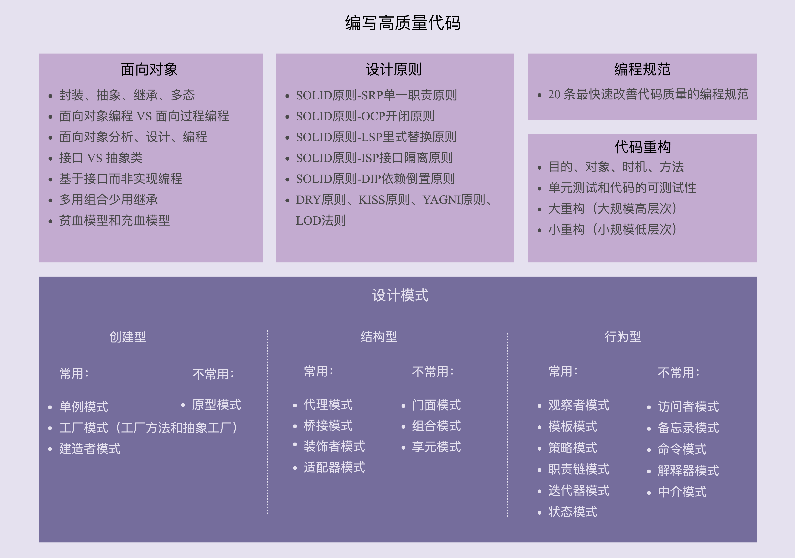

### 1，设计模式
#### 1.1 面向对象
- 面向对象的四大特性：封装、抽象、继承、多态；
- 面向对象编程与面向过程编程的区别和联系；
- 面向对象分析、面向对象设计、面向对象编程；
- 接口和抽象类的区别以及各自的应用场景；
- 基于接口而非实现编程的设计思想；
- 多用组合少用继承的设计思想；
- 面向过程的贫血模型和面向对象的充血模型；

#### 1.2 设计原则
- SOLID 原则：
  - SRP 单一职责原则
  - OCP 开闭原则
  - LSP 里氏替换原则
  - ISP 接口隔离原则
  - DIP 依赖倒置原则
- DRY 原则
- KISS 原则
- YAGNI 原则
- LOD 法则

#### 1.3 设计模式
- 解决代码的**可扩展性**问题；
- **学习目标**：了解设计模式都能解决哪些问题，掌握典型的应用场景，并懂得不过度应用；
- 创建型
  - 常用：单例模式、工厂模式（工厂方法和抽象工厂）、建造者模式；
  - 不常用：原型模式
- 结构型
  - 常用：代理模式、桥接模式、装饰者模式、适配器模式；
  - 不常用：门面模式、组合模式、享元模式
- 行为型：
  - 常用：观察者模式、模板模式、策略模式、职责链模式、迭代器模式、状态模式；
  - 不常用：访问者模式、备忘录模式、命令模式、解释器模式、中介模式；

#### 1.4 编程规范
- 解决代码的**可读性**问题；
- 更加偏重代码细节，比如：
  - 如何给变量、类、函数命名；
  - 如何写代码注释；
  - 函数不宜过长；
  - 参数不能过多；

#### 1.5 总结
- 面向对象、设计原则、设计模式、编程规范、代码重构，本质上都是服务于**编写高质量代码**这一件事。

### 2，面向对象
#### 2.1 封装(Encapsulation)
- 主要是如何隐藏信息、保护数据；
- 关键字：`public`、`private`；

#### 2.2 抽象(Abstract)
- 抽象讲的是如何隐藏方法的具体实现，让调用者只需要关心方法提供了哪些功能；
- 关键字：`interface`、`abstract`；

#### 2.3 继承(Inheritance)
- 代码复用：假如两个类有一些相同的属性和方法，就可以将这些相同的部分，抽取到父类中，让两个子类继承父类；
- 用来表示类之间的 `is-a` 关系，例如，猫是一种哺乳动物；
- **缺点**：
  - 过度使用继承，继承层次过深过复杂，就会导致代码可读性、可维护性变差。为了了解一个类的功能，我们不仅需要查看这个类的代码，还需要按照继承关系一层一层地往上查看“父类、父类的父类......”的代码。
  - 还有，子类和父类高度耦合，修改父类的代码，会直接影响子类；
- 关键字：`extends`；

#### 2.4 多态(Polymorphism)
- 多态是指，子类可以替换父类，在实际的代码运行过程中，调用子类的方法实现；

