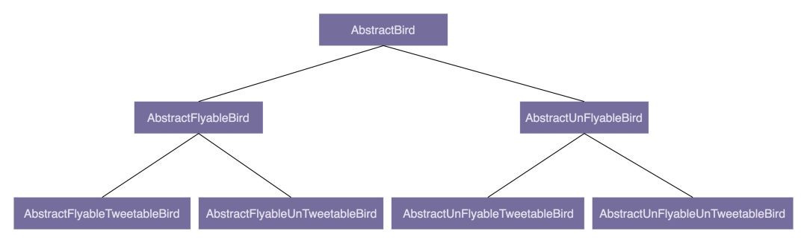

### 1，设计模式之面向对象开发
#### 1.1 面向对象
- 面向对象的四大特性：封装、抽象、继承、多态；
- 面向对象编程与面向过程编程的区别和联系；
- 面向对象分析、面向对象设计、面向对象编程；
- 接口和抽象类的区别以及各自的应用场景；
- 基于接口而非实现编程的设计思想；
- 多用组合少用继承的设计思想；
- 面向过程的贫血模型和面向对象的充血模型；

#### 1.2 设计原则
- SOLID 原则：
  - SRP 单一职责原则
  - OCP 开闭原则
  - LSP 里氏替换原则
  - ISP 接口隔离原则
  - DIP 依赖倒置原则
- DRY 原则
- KISS 原则
- YAGNI 原则
- LOD 法则

#### 1.3 设计模式
- 解决代码的**可扩展性**问题；
- **学习目标**：了解设计模式都能解决哪些问题，掌握典型的应用场景，并懂得不过度应用；
- 创建型
  - 常用：单例模式、工厂模式（工厂方法和抽象工厂）、建造者模式；
  - 不常用：原型模式
- 结构型
  - 常用：代理模式、桥接模式、装饰者模式、适配器模式；
  - 不常用：门面模式、组合模式、享元模式
- 行为型：
  - 常用：观察者模式、模板模式、策略模式、职责链模式、迭代器模式、状态模式；
  - 不常用：访问者模式、备忘录模式、命令模式、解释器模式、中介模式；

#### 1.4 编程规范
- 解决代码的**可读性**问题；
- 更加偏重代码细节，比如：
  - 如何给变量、类、函数命名；
  - 如何写代码注释；
  - 函数不宜过长；
  - 参数不能过多；

#### 1.5 总结
- 面向对象、设计原则、设计模式、编程规范、代码重构，本质上都是服务于**编写高质量代码**这一件事。


### 2，面向对象
#### 2.1 封装(Encapsulation)
- 主要是如何隐藏信息、保护数据；
- 关键字：`public`、`private`；

[代码演示](https://github.com/xianliu18/design_patterns/tree/main/src/main/java/com/noodles/oop/encapsulation)

#### 2.2 抽象(Abstract)
- 抽象讲的是如何隐藏方法的具体实现，让调用者只需要关心方法提供了哪些功能，不需要知道这些功能是如何实现的；
- 关键字：`interface`、`abstract`；

[代码演示](https://github.com/xianliu18/design_patterns/tree/main/src/main/java/com/noodles/oop/abstraction)

#### 2.3 继承(Inheritance)
- 代码复用：假如两个类有一些相同的属性和方法，就可以将这些相同的部分，抽取到父类中，让两个子类继承父类；
- 用来表示类之间的 `is-a` 关系，例如，猫是一种哺乳动物；
- **缺点**：
  - 过度使用继承，继承层次过深过复杂，就会导致代码可读性、可维护性变差。为了了解一个类的功能，我们不仅需要查看这个类的代码，还需要按照继承关系一层一层地往上查看“父类、父类的父类......”的代码。
  - 还有，子类和父类高度耦合，修改父类的代码，会直接影响子类；
- 关键字：`extends`；

#### 2.4 多态(Polymorphism)
- 多态是指，子类可以替换父类，在实际的代码运行过程中，调用子类的方法实现；
- 三种方式：
  - 通过继承实现多态特性，必须要求两个类之间有继承关系；
  - 通过接口实现多态特性，类必须实现对应的接口；
  - `duck-typing`(动态语言)：只有两个类具有相同的方法，就可以实现多态，并不要求两个类之间有任何关系；

[代码演示](https://github.com/xianliu18/design_patterns/tree/main/src/main/java/com/noodles/oop/polymorphism)

#### 2.5 抽象类和接口
- 抽象类：
  - 抽象类不允许被实例化，只能被继承；
  - 抽象类可以包含属性和方法。方法既可以包含代码实现，也可以不包含代码实现。不包含代码实现的方法叫作抽象方法；
  - 子类继承抽象类，必须实现抽象类中的所有抽象方法；
- 接口：
  - 接口中不能包含属性（也就是成员变量）；
  - 接口只能声明方法，方法不能包含代码实现；
  - 类实现接口的时候，必须实现接口中声明的所有方法；
- 抽象类表示一种 `is-a` 关系；
- 接口表示一种 `has-a` 关系，表示具有某一组行为特性。对于接口，有一个更形象的叫法，那就是**协议**(contract)；
- 抽象类更多的是为了**代码复用**，而接口就更侧重于**解耦**，隔离接口和具体的实现，提高代码的扩展性；接口是对行为的一种抽象，相当于一组协议或者契约；

#### 2.6 基于接口而非实现编程；
- **作用**：将接口与实现相分离，封装不稳定的实现，暴露稳定的接口；
- 从本质上来看，“接口”就是一组“协议”或“约定”，是功能提供者提供给使用者的一个“功能列表”；
- “基于接口而非实现编程”的**原则**：
  - 函数的命名不能暴露任何实现细节；比如，前面提到的 `uploadToAliyun()` 就不符合要求，应该去掉"aliyun"这样的字眼，改为更加抽象的命名方式，比如：`upload()`；
  - 封装具体的实现细节；比如，跟阿里云相关的特殊上传（或下载）流程不应该暴露给调用者，比如：`AliyunImageStore` 中的 `generateAccessToken()` 方法；
  - 为实现类定义抽象的接口。具体的实现类都依赖统一的接口定义，遵从一致的上传功能协议。使用者依赖接口，而不是具体的实现类来编程；
- 抽象意识、封装意识、接口意识；

#### 2.7 多用组合少用继承
- 组合优于继承，多用组合少用继承；
- 继承最大的问题就在于：继承层次过深、继承关系过于复杂会影响到代码的可读性和可维护性；
- 我们将“鸟类”这样一个抽象的事物概念，定义为一个抽象类 `AbstractBird`：
  - 根据“鸟会不会飞”，派生出更加细分的抽象类：`AbstractFlyableBird`和`AbstractUnFlyableBird`；
  - “会不会叫”以及“是否会下蛋”等等行为的增加，导致类的继承层次会越来越深、继承关系会越来越复杂；



- 利用组合(composition)、接口、委托(delegation)三个技术手段，来解决继承存在的问题；

<details>
<summary>鸟类最终实现方案</summary>

```java
// 是否会飞
public interface Flyable {
  void fly();
}

// 是否会叫
public interface Tweetable {
  void tweet();
}

// 是否会下蛋
public interface EggLayable {
  void layEgg();
}

public class FlyAbility implements Flyable {
  @Override
  public void fly() {
    System.out.println("我会飞...");
  }
}

public class TweetAbility implements Tweetable {
  @Override
  public void tweet() {
    System.out.println("我会叫...");
  }
}

public class EggLayAbility implements Eggable {
  @Override
  public void layEgg() {
    System.out.println("下蛋...");
  }
}

// 鸵鸟
public class Ostrich implements Tweetable, EggLayable {

  private TweetAbility tweetAbility = new TweetAbility();    // 组合
  private EggLayAbility eggLayAbility = new EggLayAbility(); // 组合

  @Override
  public void tweet() {
    tweetAbility.tweet();   // 委托
  }

  @Override
  public void layEgg() {
    eggLayAbility.layEgg();   // 委托
  }
}
```
</details>

### 3. 贫血模型和充血模型
- 基于贫血模型的 MVC 三层架构；
- 贫血模型：
  - 像 `UserBo` 这样，只包含数据，不包含业务逻辑的类，就叫作贫血模型；
  - 贫血模型将数据和操作分离，破坏了面向对象的封装特性，是一种典型的面向过程的编程风格；
- 充血模型：
  - 将数据和对应的业务逻辑封装到同一个类中，满足面向对象的封装特性；

#### 3.1 领域驱动设计(DDD)
- 主要用来指导如何解耦业务系统，划分业务模块，定义业务领域模型及其交互；
- 基于充血模型的 DDD 开发模式实现的代码，也是按照 MVC 三层架构分层的。Controller 层还是负责暴露接口，Repository 层还是负责数据存取，Service 层负责核心业务逻辑。它跟基于贫血模型的传统开发模式的区别主要在 Service 层。
  - 在基于贫血模型的传统开发模式中，Service 层包含 Service 类和 BO 类两部分，BO 是贫血模型，只包含数据，不包含具体的业务逻辑。业务逻辑集中在 Service 类中。
  - 在基于充血模型的 DDD 开发模式中，Service 层包含 Service 类和 Domain 类两部分。Domain 就相当于贫血模型中的 BO。不过，Domain 和 BO 的区别在于它是基于充血模型开发的，既包含数据，也包含业务逻辑。而 Service 类变得非常单薄。
  - 总结一下，就是基于贫血模型开发的传统的开发模式，重 Service 轻 BO；基于充血模型的 DDD 开发模式，轻 Service 重 Domain；
- 开发流程的不同：
  - 基于贫血模型的传统开发模式，大部分都是 SQL 驱动的。我们接到一个后端接口的开发需求的时候，就去看接口需要的数据对应到数据库中，需要哪张表或者哪几张表，然后思考如何编写 SQL 语句来获取数据。之后就是定义 Entity、BO、VO，然后模板式地往对应的 Repository、Service、Controller 类中添加代码；
  - 基于充血模型的 DDD 的开发模式，需要事先理清楚所有的业务，定义领域模型所包含的属性和方法。领域模型相当于可复用的业务中间层。新功能需求的开发，都基于之前定义好的这些领域模型来完成。

- DDD 开发模式中，Service 类的职责：
  - Service 类负责与 Repository 交流。为了保持领域模型的独立性，不与任何其他层的代码（Repository 层的代码）或开发框架（比如 Spring、Mybatis）耦合在一起，将流程性的代码逻辑（比如从 DB 中取数据、映射数据）与领域模型的业务逻辑解耦，让领域模型更加可复用；
  - Service 类负责跨领域模型的业务聚合功能；
  - Service 类负责一些非功能性及与三方系统交互的工作。比如幂等、事务、发邮件、发消息、记录日志、调用其他系统的 RPC 接口等，都可以放到 Service 类中；
- DDD 开发模式中，Controller 层和 Repository 层还是贫血模型的原因：
  - Controller 层的 VO，实际上，VO 是一种 DTO(Data Transfer Object, 数据传输对象)。它主要是作为接口的数据传输承载体，将数据发送给其他系统。从功能上来讲，它理应不包含业务逻辑、只包含数据；
  - Repository 层的 Entity，Entity 的生命周期是有限的。一般来讲，我们把它传递到 Service 层之后，就会转化成 BO 或者 Domain 来继续后面的业务逻辑。Entity 的生命周期到此就结束了。

### 4. 面向对象开发实战
#### 4.1 面向对象需求分析
#### 4.2 面向对象设计和编程
- 划分职责进而识别出有哪些类；
- 定义类及其属性和方法；
- 定义类与类之间的交互关系；
- 将类组装起来并提供执行入口；

#### 4.2.1 六种类之间的关系
- UML 统一建模语言中定义了六种类之间的关系；
- 从更加贴近编程的角度，作者对类与类之间的关系做了调整，只保留了四个关系：泛化、实现、组合、依赖；
  - 泛化、实现、依赖的定义不变；
  - 组合关系替代 UML 中组合、聚合、关联三个概念；

<details>
<summary>六种类之间的关系</summary>


- **泛化**(Generalization)可以简单理解为继承关系。

```java
public class A { ... }
public class B extends A { ... }
```

- **实现**(Realization)一般是指接口和实现类之间的关系。

```java
public interface A { ... }
public class B implements A { ... }
```

- **聚合**(Aggregation)是一种包含关系，A 类对象包含 B 类对象，B 类对象的生命周期可以不依赖 A 类对象的生命周期，也就是说可以单独销毁 A 类对象而不影响 B 对象，比如课程与学生之间的关系。

```java
public class A {
  private B b;
  public A(B b) {
    this.b = b;
  }
}
```

- **组合**(Composition)也是一种包含关系。A 类对象包含 B 类对象，B 类对象的生命周期跟依赖 A 类对象的生命周期，B 类对象不可单独存在，比如鸟与翅膀之间的关系。

```java
public class A {
  private B b;
  public A() {
    this.b = new B();
  }
}
```

- **关联**(Association)是一种非常弱的关系，包含聚合、组合两种关系。具体到代码层面，如果 B 类对象是 A 类的成员变量，那 B 类和 A 类就是关联关系。

```java
public class A {
  private B b;
  public A(B b) {
    this.b = b;
  }
}

// 或者

public class A {
  private B b;
  public A() {
    this.b = new B();
  }
}
```

- **依赖**(Dependency)是一种比关联关系更加弱的关系，包含关联关系。不管是 B 类对象是 A 类对象的成员变量，还是 A 类的方法使用 B 类对象作为参数或者返回值、局部变量，只要 B 类对象和 A 类对象有任何使用关系，我们都称它们有依赖关系。

```java
public class A {
  private B b;
  public A(B b) {
    this.b = b;
  }
}

// 或者
public class A {
  private B b;
  public A() {
    this.b = new B();
  }
}

// 或者
public class A {
  public void func(B b) { ... }
}
```
</details>

